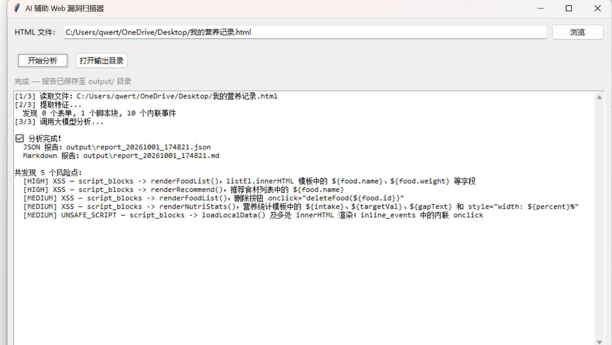

# AI 辅助 Web 漏洞风险扫描器

基于大模型的本地Web安全分析工具：解析HTML提取表单、内联事件、危险JS调用等风险特征，
调用 DeepSeek API 进行 XSS / SQL 注入风险分析，输出 JSON + Markdown 双格式报告。

## 运行截图

## 功能
- BeautifulSoup + 正则提取 4 类风险特征
- 大模型结构化风险分析（风险等级 / 触发位置 / 修复建议）
- GUI 界面 + 多线程异步扫描，报告自动落盘 JSON + Markdown

## 如何运行
